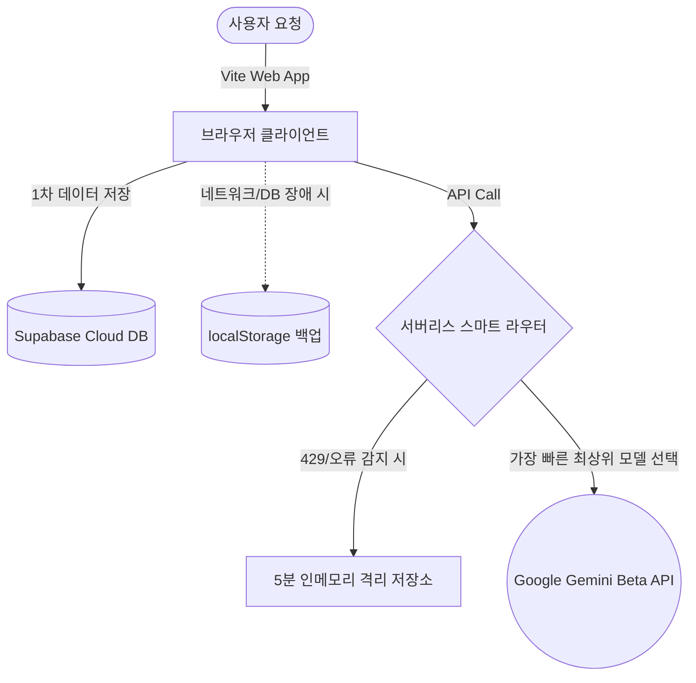

# 제품 요구사항 정의서 (PRD): 학교문서AI (School Doc AI)

## 1. 제품 개요 (Product Overview)
*   **제품명**: 학교문서AI (School Doc AI)
*   **대상 사용자**: 대한민국 유치원 및 초·중·고등학교 교직원 (교사, 행정실원 등)
*   **제품의 목적**: 대한민국 교육부 행정업무운영 편람 및 공문서 작성 규칙을 완벽하게 준수하는 AI 기반 문서 자동화 도구를 제공하여, 교사들이 겪는 막대한 행정 업무 부담을 줄이고 본업인 교육 활동과 학생 지도에 전념할 수 있도록 돕습니다.
*   **핵심 가치**:
    *   **행정 표준 규칙 준수**: 1단계(1.)부터 7단계(①)까지 번호 기호 체계 및 들여쓰기 자동 정렬.
    *   **HWP 호환성 최적화**: 한컴오피스 한글 프로그램에 복사-붙여넣기 시 원본 서식과 표 구조가 완벽하게 복제되는 전용 클립보드 파서 내장.
    *   **스마트 폴백 및 쿨다운**: 실시간 API 호출 한도 및 부하 상황에 대응하여 백업 모델로 지연 없이 전환되는 회복탄력성 구축.
    *   **프라이버시 및 오프라인 백업**: 로그인 상태에서는 Supabase 클라우드 DB에 영구 백업하며, 오프라인 또는 서버 불안정 시 브라우저 로컬 저장소(`localStorage`)에 자동 폴백 저장.

---

## 2. 타겟 사용자 및 사용자 스토리 (Target Audience & User Stories)
### 2.1 타겟 사용자
*   **학급 담임 교사**: 가정통신문, 학부모 알림 문자, 학급 운영 계획서 등을 주기적으로 작성하는 교사.
*   **계 담당 및 행정 담당 교사**: 에듀파인 기안문, 소요 예산이 포함된 사업 계획서, 결과 보고서 등을 작성하는 부서 교사.
*   **학교 관리자 (교장, 교감)**: 교직원 연수 계획 및 대외 보도자료를 검토하고 발송하는 관리자.

### 2.2 사용자 스토리
*   *"기획계 교사로서 1년짜리 예산 계획서를 짜야 하는데, 표 서식과 줄간격을 맞추고 한글 문서에 맞게 작성하는 시간을 1시간에서 5분으로 줄이고 싶다."*
*   *"초등 담임 교사로서 퇴근 직전 급하게 학부모님 문의에 따뜻하면서도 격식 있는 답변 문자를 지연 없이 전송하고 싶다."*
*   *"학교 행사 학사일정을 이미지로 받았는데, 이를 일일이 손으로 쳐서 연간 시간표에 등록하지 않고 사진 한 장으로 시수 계산까지 끝내고 싶다."*

---

## 3. 핵심 기능 요구사항 (Core Feature Requirements)

### 3.1. 8가지 학교 문서 자동 작성 엔진 (`create.html`, `app.js`, `gemini.js`)
사용자가 간단한 키워드나 기본 조건만 던지면 AI가 양식에 맞춘 공문서를 자동 작성합니다.

| 문서 유형 | 주요 스펙 및 AI 작문 규칙 |
| :--- | :--- |
| **에듀파인 기안문** | - K-에듀파인 기안기 본문 규격 준수. 불필요한 상단 학교명, 하단 발신명 생략. - 내부결재 및 외부발송(수신자 참조) 포맷 구분 지원. - **3단계 복잡도** 지원: SIMPLE (세부 항목 없음), MEDIUM (1줄 이내 요약), COMPLEX (상세 개요 및 표 지원). - 문장의 마무리에 반드시 2칸 공백 후 **'끝.'** 강제 주입. |
| **운영 계획서** | - 추진배경 ➔ 목적 ➔ 운영방침 ➔ 세부추진계획 ➔ 소요예산(안) ➔ 기대효과 6단계 표준 포맷. - 세부 계획 및 소요 예산은 반드시 시각적 가로 폭 100%를 차지하는 HTML `<table>`로 자동 생성. - A4 지정 페이지 수(1~5장)에 부합하는 글자 수 범위 통제 기능 내장. |
| **결과 보고서** | - 기 작성된 계획서 파일(텍스트 또는 이미지) 탑재 시 이를 분석하여 결과 보고서 포맷 자동 변환. - 계획 대비 예산 집행액/잔액 비교표 자동 작성. |
| **가정통신문** | - 학부모 대상 격식 있는 합쇼체 적용. - 제목(중앙) ➔ 계절/학기별 인사 ➔ 본문 ➔ 맺음말 ➔ 날짜 ➔ 학교장 직인란 포맷 생성. |
| **학부모 문자** | - SMS(40자), MMS(200자), LMS(1000자) 바이트 한도 맞춤형 길이 통제. - 발신 목적에 따른 3가지 톤 조절: INITIAL (공식 소속 제시), REPLY (정중한 회신), TEACHER_REPLY (담임교사 친밀 어조). |
| **지출품의서** | - 물품 구입, 수당 지급, 업무추진비(협의회) 카테고리별 품의 요건 자동화. - 산출내역은 표 대신 공문서 전용 명사형 개조식 텍스트로 대체 구성. |
| **협의회 회의록** | - 일시/장소/출석위원/안건/발언자별 내용 요약/서명란이 담긴 표준 테이블 폼 렌더링. |
| **보도자료** | - 언론사 배포용 5W1H 정형식 보도자료 텍스트 및 하단 SNS 업로드용 요약(이모지, #해시태그) 패키지 일괄 생성. |

---

### 3.2. 연간 학사일정 및 시간표 분석기 (`calendar.html`, `calendar.js`)
기본 시간표 템플릿과 개별 변동 내역(예외 상황)을 조화롭게 분리하여 연간 1,000시간이 넘는 수업 시수를 추적합니다.

*   **연간시수 통계표**:
    *   과목별 목표 시수(교육과정 기준) 설정 기능.
    *   **학기 구분 자동 정렬**: 설정된 **'2학기 시작일' (기본값: 8월 5일)**을 기준으로 날짜를 자동 계산하여 1학기 시수 / 2학기 시수 / 연간 합계 / 목표치 대비 연간 증감을 실시간 표시.
*   **8주 단위 내비게이션**: 1년을 8주 단위 탭으로 나누어 렌더링 부하를 줄이고 시간표 관리 가독성 확보.
*   **주간 시간표 셀 수정 및 실시간 계산**: 시간표 셀(월~토, 1~10교시) 클릭 시 과목 팔레트 및 직접 입력을 통해 실시간으로 과목 수정이 가능하며, 수정 즉시 상단 통계표에 자동 연동.
*   **AI 파일 분석 탑재**: 연간 시간표 이미지 또는 PDF 파일을 첨부하면 AI가 `(YYYY-MM-DD-교시) -> 과목명` JSON 배열을 정교하게 분석·추출하여 달력 데이터를 즉시 채워주는 스마트 변환 기능 제공.

---

### 3.3. 소통메신저 분석 및 작성기 (`messenger.html`, `messenger.js`)
학교 내에서 사용하는 소통메신저 캡처본(이미지)을 기반으로 업무 피로도를 최소화합니다.

*   **스마트 OCR 분석**:
    *   캡처본 업로드 시 AI가 수신날짜, 발신부서/성명, 플랫폼(나이스/이로미/카카오워크 등), 업무 분류, 우선순위(긴급/높음/보통), 핵심 요약 3줄, 교사 행동 요령(Required Actions)을 완벽히 구조화된 JSON 데이터로 반환.
*   **맞춤형 쪽지 답장 생성**:
    *   수신 대상(동료 교사, 관리자/장학사, 학부모)의 성격에 맞춰 상호 존중 및 공용 톤앤매너 적용.
    *   메신저 본문에 잔여 마크다운 기호(`**`, `#` 등)가 노출되지 않도록 가독성 중심의 플레인 텍스트로 쪽지 초안 렌더링.

---

### 3.4. 선도학교 AI 캐릭터 생성기 (`leading.html`, `leading.js`)
*   사용자 실물 사진 업로드 시 Gemini 멀티모달 Vision API를 통해 **2D 만화풍/치비(Chibi, 3~3.5등신) 스타일**의 교직원 홍보 캐릭터 이미지를 생성 및 로컬 다운로드 지원.

---

## 4. 비기능적 요구사항 & 시스템 안정성 (Non-Functional & Reliability)

### 4.1. 스마트 폴백 (Smart Fallback) & 쿨다운 기술
네트워크 속도 저하와 부하 상황 속에서도 교사들이 문서 작성을 멈추지 않도록 가용한 최적의 통로를 실시간 매핑합니다.
*   **모델 풀 관리**:
    *   텍스트 모델 풀: `gemini-3.1-flash-lite-preview` ➔ `gemini-2.5-flash-lite` ➔ `gemini-2.5-flash` ➔ `gemini-flash-latest`
    *   이미지 모델 풀: `gemini-3.1-flash-image-preview` ➔ `gemini-2.5-flash-image`
*   **동적 격리 (In-memory Cooldown)**:
    *   API 호출 시 특정 모델이 `429 (Rate Limit)` 또는 `5xx (Server Error)`를 반환하면 해당 모델을 **5분 동안 쿨다운 큐로 강등 격리**시킵니다.
    *   격리 기간 동안의 재요청 시에는 1순위 모델을 찔러보는 불필요한 대기 시간(Latency)을 거치지 않고, 가용한 다음 순위 모델로 즉시 점프(Bypass)합니다.
    *   5분이 경과하면 쿨다운이 자동으로 해제되어 정상 복귀합니다.

### 4.2. 모바일 반응형 웹 디자인 (Responsive UI)
*   **Break Point (768px 이하)**:
    *   가로 폭이 제한되는 모바일 디바이스 감지 시 4열, 3열 그리드로 설계된 데스크탑 와이드 배치를 **1열 수직 정렬 카드 레이아웃**으로 재구성합니다.
    *   학사일정 페이지의 상단 주요 액션 버튼 그룹이 겹치지 않도록 너비 100%의 수직 정렬 터치 버튼으로 변경하여 엄지손가락 터치 편리성을 제공합니다.
    *   헤더 네비게이션 항목들을 가로 스크롤 가능한 슬라이드 형태로 랩핑하여 UI 뭉개짐을 차단합니다.

---

## 5. 시스템 아키텍처 및 데이터 흐름 (System Architecture)

*   **프론트엔드**: HTML5, Vanilla CSS (Pretendard 폰트 시스템), Vanilla Javascript (ES Module).
*   **서버리스 백엔드**: Netlify Functions & Vercel Serverless Functions (`api/` 하위 파일 분산).
*   **클라우드 데이터베이스**: Supabase Auth 및 Supabase Postgres (`documents` 테이블).
